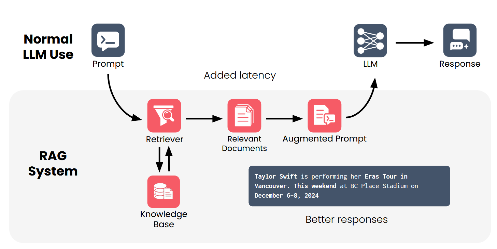

# RAG Overview

## **Introduction to RAG**
### 1. What LLMs Can Do
- LLMs can answer questions, summarize and rewrite text, give feedback, and generate code.
- These abilities feel human-like because they are trained on massive amounts of text.
- They rely on their internal knowledge when generating responses.

---

### 2. Why RAG Is Needed
- LLMs don’t always have the information needed to answer accurately.
- They may lack:
  - Recent information
  - Private or hidden data
  - Specialized or niche knowledge
- This leads to gaps in understanding unless extra context is provided.

---

### 3. Example Questions
- *Why are hotels expensive on weekends?*  
  General knowledge is enough to answer.
- *Why are hotels in Vancouver expensive this weekend?*  
  Requires recent information (e.g., an event like a Taylor Swift concert).
- *Why doesn’t Vancouver have more hotel capacity downtown?*  
  Requires deep, specialized research (history, urban planning).
- These show that both humans and LLMs sometimes need to collect information first.

---

### 4. Two Phases of RAG
- **Retrieval:** Collect relevant information from a knowledge source.
- **Generation:** Use the retrieved information + user query to create a final response.
- Retrieval is only needed when the model lacks certain knowledge.

---

### 5. LLM Limitations
- LLMs learn only from their training data, usually from public web sources.
- They cannot know private databases, very recent events, or obscure topics.
- It’s unrealistic to expect them to be experts on everything without extra context.

---

### 6. How RAG Solves This
- RAG adds external information to the prompt before sending it to the LLM.
- The system retrieves relevant documents or facts.
- The prompt is augmented with this retrieved context.
- The LLM then generates a more accurate, grounded response.

---

### 7. Components of a RAG System
- **Retriever:** Searches a knowledge base for relevant information.
- **Knowledge Base:** Contains trusted, private, or domain-specific documents.
- **LLM:** Generates the final answer using both the query and retrieved info.

---

### 8. Definition
- **Retrieval-Augmented Generation (RAG)** improves an LLM’s output by retrieving useful external information and including it in the prompt.
- It ensures the model can access information beyond what it was trained on.

## **Applications of RAG**

### 1. Code Generation
- LLMs have been trained on a large amount of code, including public repositories.
- Generating correct code for a specific project requires specialized knowledge of the project’s classes, functions, definitions, and coding style.
- A RAG system can use your codebase as a knowledge base, allowing the LLM to retrieve relevant files, definitions, and classes.
- This makes the LLM much more capable of generating code or answering project-specific questions.

---

### 2. Customizing Enterprise Chatbots
- Companies have unique products, policies, and communication guidelines.
- Treating enterprise documents as a knowledge base allows LLMs to be used effectively in customer service or internal support.
- Examples:
  - A customer service chatbot can provide accurate product info, inventory status, and troubleshooting steps.
  - An internal chatbot can answer questions about company policies or guide employees to relevant documentation.
- The knowledge base ensures responses are grounded in the company’s specific information and reduces generic or misleading answers.

---

### 3. Healthcare and Legal Applications
- In domains requiring high precision, such as healthcare and law, RAG can be critical.
- Knowledge bases can include legal documents, case-specific information, or newly published medical research.
- A RAG-based approach allows LLMs to use private or niche data, ensuring more accurate and trustworthy outputs.

---

### 4. AI-Assisted Web Search
- Traditional search engines act like retrievers by returning relevant websites for a query.
- Modern AI search engines augment this with summaries of the results.
- These AI-generated summaries are effectively a RAG system, with the knowledge base being the entire internet.

---

### 5. Personalized Assistants
- Highly personalized RAG systems enhance productivity in email, messaging, calendars, word processors, and other tools.
- Knowledge bases may include personal text messages, emails, contact lists, or project documents.
- Even small-scale personal information can provide important context, allowing the LLM to complete tasks more relevantly and efficiently.

---

### 6. Broad Applicability
- RAG has wide applicability across industries and personal use cases.
- Any collection of information not included in an LLM’s training data can be used to improve responses.
- RAG enables LLMs to operate effectively in contexts that might otherwise be impossible.
- Recognizing opportunities to apply RAG can enhance productivity, decision-making, and problem-solving.

## **RAG Architecture Overview**
### 1. Core Components
- A RAG system has three main components:
  - **LLM:** The language model that generates text.
  - **Knowledge Base:** A collection of relevant documents or information.
  - **Retriever:** Searches the knowledge base to find information relevant to a user prompt.

---

### 2. User Experience
- From a user’s perspective, using a RAG system feels the same as using a standard LLM.
- The user types a prompt and receives a response.
- Internally, additional steps occur:
  - The prompt is first sent to the retriever.
  - The retriever queries the knowledge base and returns the most relevant documents.
  - An augmented prompt is created, combining the original question with retrieved information.
  - This augmented prompt is sent to the LLM to generate a response.

---

### 3. How the Augmented Prompt Works
- Example: Original question: *Why are hotels in Vancouver so expensive this coming weekend?*
- The system retrieves relevant documents (e.g., news articles, event info).
- The augmented prompt might read:  
  *“Answer the following question. Here are five relevant articles to help you respond…”*  
- The LLM then generates a response using both its training knowledge and the retrieved context.

---

### 4. Key Advantages of RAG
1. **Access to otherwise unavailable information:**  
   - Company policies, personal information, or recent events can be added via the knowledge base.
2. **Reduced hallucinations:**  
   - LLMs are less likely to generate misleading or generic text when grounded with retrieved documents.
3. **Up-to-date information:**  
   - Instead of retraining the model, simply update the knowledge base to provide new information.
4. **Improved source citation:**  
   - Citations can be added to the augmented prompt, allowing the LLM to reference sources in its output.
5. **Specialization of components:**  
   - The retriever handles fact-finding and filtering, while the LLM focuses on generating high-quality text.

---

## **Introduction to LLM**

### 1. What LLMs Do
- LLMs predict the next word (or token) in a sequence based on the prompt.
- A **prompt** is the initial text, and a **completion** is the generated continuation.
- LLMs are **autoregressive**: each generated token influences the next one.
- Randomness in token selection leads to different completions for the same prompt.

---

### 2. How LLMs Work
- LLMs use a neural network with billions of parameters to model language.
- They generate a **probability distribution** over all tokens for each next word.
- Tokens can be whole words or subword pieces, enabling flexible word formation.
- Training involves predicting next words in large text corpora and adjusting parameters.

---

### 3. Limitations
- LLMs generate **probable text, not guaranteed true text**.
- They may **hallucinate** if asked about private, niche, or very recent information.
- Prompting alone is insufficient for information outside the training data.

---

### 4. How RAG Helps
- RAG adds **relevant information to the prompt** to ground the LLM’s responses.
- LLMs can integrate this extra context even if it wasn’t part of their training.
- Limitations exist due to **context window size** and computational cost, but newer models support very large windows.

---

## **Introduction to Retrievers**
### 1. Purpose of the Retriever
- Provides useful information to the LLM that might not have been in its training data.
- Acts as the intermediary between the prompt and the knowledge base.

---

### 2. Library Analogy
- Knowledge base = library collection of documents.
- Retriever = librarian who understands the question and finds the relevant books.
- Indexing organizes documents to make retrieval efficient.

---

### 3. How a Retriever Works
- Processes the prompt to understand its meaning.
- Searches the indexed knowledge base for relevant documents.
- Returns documents ranked by **relevance score** (usually based on similarity to the prompt).
- Balances retrieving enough relevant documents while avoiding irrelevant ones to prevent clutter and excessive context window usage.

---

### 4. Challenges
- Some relevant documents might be ranked too low, while irrelevant ones may rank too high.
- Deciding how many documents to return requires monitoring and experimentation.
- Optimizing the retriever is crucial for maintaining accuracy and efficiency.

---

### 5. Implementation
- Many familiar systems perform similar tasks:
  - Web search engines retrieve relevant web pages.
  - Relational databases retrieve matching rows/tables.
- Modern retrievers are often built on **vector databases**, which are optimized for finding documents that closely match a prompt.
- Understanding general **information retrieval principles** is key to building effective retrievers.
