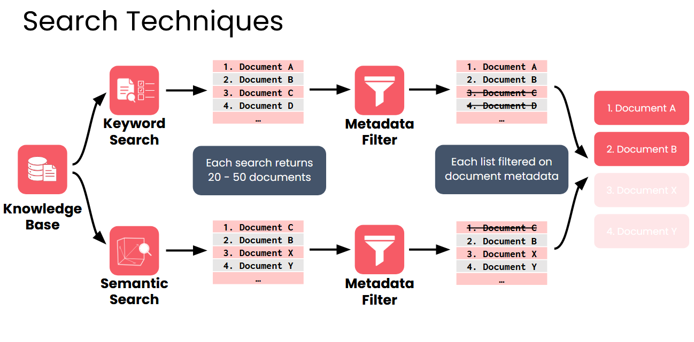

# Information Retriever and Search Foundations

A retriever finds useful documents from a knowledge base so the LLM can answer a question.

- This sounds simple, but it's actually hard because:

- Users talk in normal language, not clear search queries.

- The stored documents can be emails, memos, reports, or articles.

- These documents are written for humans, not computers.

- The retriever must search lots of messy text fast and return the most relevant parts within seconds.

Retrievers use different search techniques to match user questions with the right information.
Each method has strengths and weaknesses, and good retrievers often combine multiple methods for the best results.

## Retriever Architecture Overview
Most retrievers use two search methods:
- **Keyword search** — finds documents with the same words as the prompt.
- **Semantic search** — finds documents with similar meaning, even if the same words are not used.

Each method gives a list of documents. Some documents may appear in both lists, but they might have different rankings.

Next, the retriever applies metadata filters. For example, documents meant for Engineering users are kept, and documents meant only for HR are removed if the user is not in HR.

After filtering, the retriever combines both lists and creates one final ranked list. It then returns the top documents to the LLM. This is called hybrid search.

**Metadata filtering** → removes documents that don't fit specific rules 

A good retriever blends these methods to get the best results.

## Metadata Filtering
- **What it is**: Uses fixed criteria (metadata) to narrow down documents. Metadata can include title, author, date, access level, region, etc.

- **Example**: A newspaper retriever:

    - Articles have metadata: title, author, date, section.

    - Filter for “Opinion articles by Jane Doe between June–July 2024.”

    - Only matching articles are returned.

- **How it works**:

    - Like filtering a spreadsheet or writing a SQL query.

    - Not based on the user’s question directly, but on attributes like subscription status or region.

- **Benefits**:

    - Simple and easy to understand.

    - Fast and well-optimized.

    - Ensures strict criteria are met for document retrieval.

- **Limitations**:

    - Not a true search technique, ignores content.

    - Too rigid.

    - Cannot rank documents.

- **Usage**:

    - Typically combined with keyword or semantic search to refine results.

    - Alone, metadata filtering is not sufficient for retrieval.

## TF-IDF
